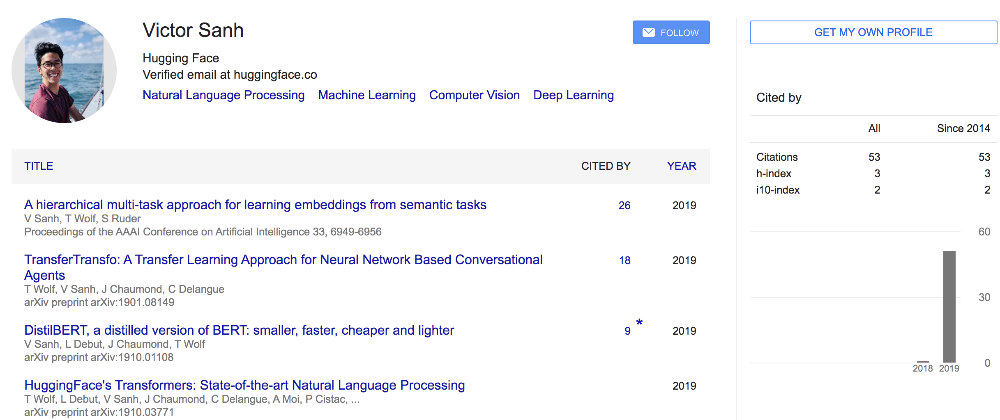
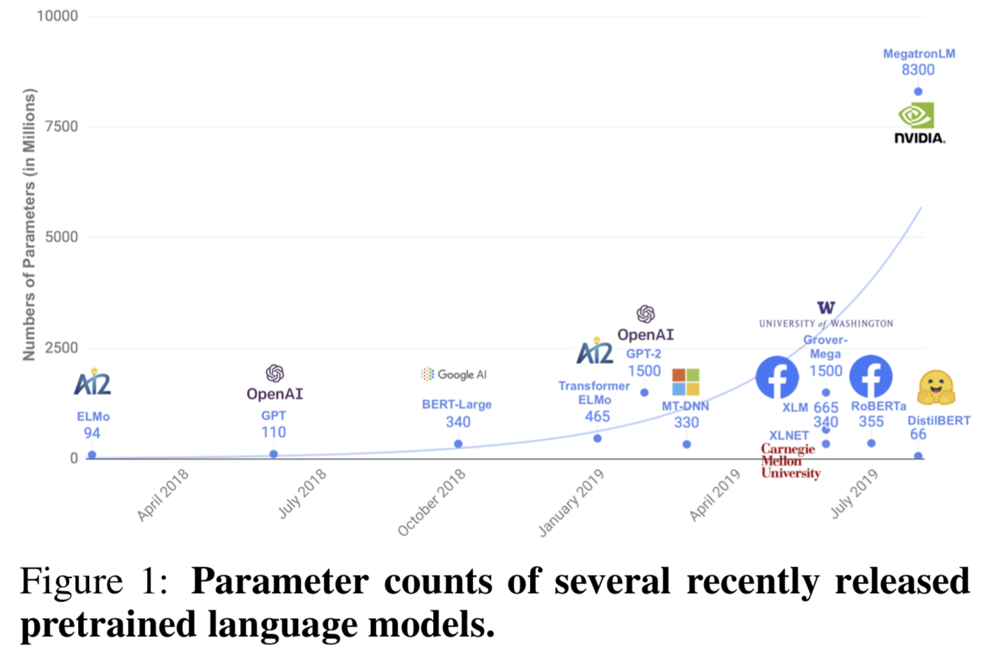
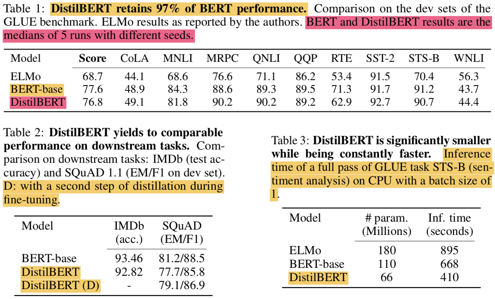

### DistilBERT, <br>a distilled version of BERT: smaller, faster, cheaper and lighter

<span style="font-size:80%">
  
- 저자:
   - Victor SANH, Lysandre DEBUT, Julien CHAUMOND, Thomas WOLF
 (**Hugging Face**) 
- 발표:
   - Presenter: 윤주성
   - Date: 191204

---

### Who is an Author?
<span style="font-size:50%">
  
- AAAI를 들고 있는 NLP 하던 분인 듯
- Thomas Wolf(huggingface)와 주로 작업하는 듯함


---

#### 느낀점
<span style="font-size:70%">
  
- 일단 논문이 짧다. 좋아.
- soft target probability로 CE한거랑, MLM, Cosine Embedding Loss만으로 좋은 성적을 얻음 (cosine embedding을 사용한건 기여할만함)
- 최근 나왔던 MobileBERT처럼 Attention에 자체에 대해서 distillation하지 않아도 나쁘지 않은 결과가 나오는구나 싶긴함 물론 MobileBERT가 더 최신이니 Attention 자체에 대해서도 적용하면 좋겠지만.. 이건 BERT끼리만 가능한 approach니..
- weight initialization을 teacher network 에서 가져오는것도 나쁘진 않았음(layer 차이가 나서 좀 다르긴하지만)
- pre-train도 distillation 쓰고, fine-tune도 distillation 쓰면 잘되는건 알겠음.. 괜찮은 방법이긴한데 여러케이스가 존재할 수 있을것 같아 좀 더 비교가 필요해보임

---

#### Abstract
<span style="font-size:70%">
  
- NLP에서 large-scale pre-trained models에서 Transfer Learning하는게 매우 보편화됨
- 그에 따라 computational training or inference가 제한되는 환경(one-the-edge)에서 이런 모델을 돌리는게 challenge가 됨
- 본 논문에서는 DistilBERT라는 좀 더 작은 general purpose language representation model을 pre-train 하는 방법을 제안하고자 함
- 대부분의 이전 연구들은 task-specific models을 만드는데 집중되어있었지만, 저자는 pre-training phase때 knowledge distillation하는데 집중함
- 모델 크기는은 버트대비 40%감소했고 언어 이해 능력은 97%로 유지했고 속도도 60% 더 빠름
- pre-training할 때, inductive biases를 larger model로부터 학습하기 위해 3가지를 조합한 loss를 제안함(```language modeling, distillation and cosine-distance losses```)
- 제안하는 더 작고, 빠르고, 가벼운(smaller, faster and lighter (~~smaller와 lighter 차이가 뭐야..~~)) 모델은 더 적은 비용으로 pre-train도 할 수 있음
- capabilities for on-device computation에 대해 proof-of-concetp experiment와 비교할만한 on-device 연구들을 통해 설명할 것임

---

#### 1. Introduction
<span style="font-size:70%">
  

- 지난 몇년간 NLP에서는 Transfer Learning이 아주 핫했고 large-scale pre-trained LM을 쓰는건 NLP Tasks에서 하나의 기본적인 tool이 되어버림 (Devlin et al., 2018, Radford et al., 2019, Liu et al., 2019)

   
---
#### 1. Introduction
<span style="font-size:70%">
  
- 모델 성능은 좋아졌지만 빈번하게 수백만의 파라미터를 갖게되었고 현재까지의 연구로는 더 모델크기를 키우면 downstream task에서 더 높은 성능이 나오고 있음
- 모델이 커지는건 몇가지 우려를 낳고 있음
   - 첫째는, 환경적 비용이 문제가됨 (```First is the
environmental cost of exponentially scaling these models’ computational requirements as mentioned in Schwartz et al. [2019], Strubell et al. [2019]```)
   - 둘째는, on-device에서 real-time으로 실행하면 새로운 application들을 가능케해줄수있을지라도, 계산비용이 증가하고 필요한 메모리가 커져서 다양한 곳에 적용하기엔 어렵게 만듬(```Second, while operating these models on-device in real-time has the potential to enable novel and interesting language processing applications, the growing computational and memory requirements of these models may hamper wide adoption```)
- 본 논문에서는 knoledge distillation으로 경량화한 LM 모델도 비슷한 성능을 낼수 있는걸 보임. 경량화헀으니 학습 비용도 적음
- 3가지의 loss를 써서, bigger Trasnformer LM로 supervision해서 distillation한 결과 40% smaller Transformer를 만듬 (60% 더 빠른 inference time 갖게됨)

---

#### 2. Knowledge distillation
<span style="font-size:70%">

- **Knowledge distillation** (Bucila et al., 2006, Hinton et al., 2015)은 모델을 압축하는 기술임
   - the student model(compact model)은 the teacher model(larger model or ensemble of models)을 재생산하기 위해 학습됨
   - 지도학습에서 분류모델은 instance class를 예측하기위해 학습되는데, gold label의 estimated probability를 최대로하게 끔 학슴함
   - 보통의 training objective는 모델이 예측한 확률 분포와 one-hot empirical distribution of training labels의 cross-entropy를 최소화하게끔 함
   - 학습셋에서 잘 동작하는 모델은 correct class에 대해서 output distribution을 높은값을 갖는 확률로 예측하고 나머지는 거의 0에 가까운 확률로 예측하게됨
   - 하지만 이러한 "0"("near-zero")에 가까운 확률들중 일부는 다른것보다 더 큰데, model의 generalization capbilities를 반영하고 test set에서 얼마나 잘 동작할지를 보여줌

---
#### 2. Knowledge distillation
<span style="font-size:70%">

- **Training loss**
   - the student는 soft target probabilities of the teacher에 대한 distillation loss로 학습함
   -  ${ t_{i} }$는 teacher고 ${ s_{i} }$는 student라 할때 Loss는 다음과 같음
   $$
   L_{c e}=\sum_{i} t_{i} * \log \left(s_{i}\right) \text { where } t_{i}\left(\text { resp. } s_{i}\right)
   $$
   - 이러한 목적함수는 the full teacher distribution을 활용할 수 있어서 충분한 training signal이 됨
   - Hinton을 따라, *softmax-temperature*를 사용했음
   $$
   p_{i}=\frac{\exp \left(z_{i} / T\right)}{\sum_{j} \exp \left(z_{j} / T\right)}
   $$
   - ${ T }$는 output distribution의 soomthness를 조절하는 텀이고, ${ z_{i}}$는 class ${ i }$에 대한 model score를 의미함
   - 학습시에는 same temperature ${ T }$를 student & teacher에게 적용하고 inference할때는 ${ T }$ 값을 1로 셋팅해서 standard *softmax*를 사용함
   - the final training objective는 distillation loss ${ L_{ce} }$를 the supervised training loss와 linear combination한 것임
      - maksed language modeling loss ${ L_{mlm} }$ (~~BERT니까..~~)
      - cosine embedding loss ${ L_{cos} }$ (하다보니 발견하게 되었다고 함, student model과 teacher model의 hidden states vectors의 방향을 align 해줌! (~~오..!~~))   
   
---
<span style="font-size:50%">

### Loss 관련 코드

```python

s_logits, s_hidden_states = self.student(input_ids=input_ids, attention_mask=attention_mask)     # (bs, seq_length, voc_size)
with torch.no_grad():
	t_logits, t_hidden_states = self.teacher(input_ids=input_ids, attention_mask=attention_mask) # (bs, seq_length, voc_size)
    
loss_ce = self.ce_loss_fct(F.log_softmax(s_logits_slct/self.temperature, dim=-1),
                           F.softmax(t_logits_slct/self.temperature, dim=-1)) * (self.temperature)**2
                                   
loss = self.alpha_ce*loss_ce
loss_mlm = self.lm_loss_fct(s_logits.view(-1, s_logits.size(-1)), lm_labels.view(-1))
loss += self.alpha_mlm * loss_mlm

loss_mse = self.mse_loss_fct(s_logits_slct, t_logits_slct)/s_logits_slct.size(0) # Reproducing batchmean reduction
loss += self.alpha_mse * loss_mse

s_hidden_states = s_hidden_states[-1]                              # (bs, seq_length, dim)
t_hidden_states = t_hidden_states[-1]                              # (bs, seq_length, dim)
mask = attention_mask.unsqueeze(-1).expand_as(s_hidden_states)     # (bs, seq_length, dim)
assert s_hidden_states.size() == t_hidden_states.size()
dim = s_hidden_states.size(-1)
            
s_hidden_states_slct = torch.masked_select(s_hidden_states, mask)        # (bs * seq_length * dim)
s_hidden_states_slct = s_hidden_states_slct.view(-1, dim)                # (bs * seq_length, dim)
t_hidden_states_slct = torch.masked_select(t_hidden_states, mask)        # (bs * seq_length * dim)
t_hidden_states_slct = t_hidden_states_slct.view(-1, dim)                # (bs * seq_length, dim)
        
target = s_hidden_states_slct.new(s_hidden_states_slct.size(0)).fill_(1) # (bs * seq_length,)
loss_cos = self.cosine_loss_fct(s_hidden_states_slct, t_hidden_states_slct, target)
loss += self.alpha_cos * loss_cos

```

Code Reference: https://github.com/huggingface/transformers/blob/7edb51f3a516ca533797fb2bb2f2b7ce86e0df70/examples/distillation/distiller.py#L366
   
---   
#### 3. DistilBERT: a distilled version of BERT
<span style="font-size:70%">

##### Student architecture
- the student - DistilBERT는 BERT의 general architecture과 같음
- The token-type embeddings and the pooler are removed while the number of layers is reduced by a factor of 2 (레이어수는 2배 감소)
- Transformer architecture에서 쓰이는 대부분의 Ops인 linear layer나 layer normalisation은 modern linear algebra frameworks로 highy optimized됨
- 조사결과, last dimension (hidden size dimension)에 대한 변형은 layer 개수 변경에 비하면 computation efficiency에서 큰 임팩트가 없음을 알게됨
- 그렇기 때문에 레이어를 줄이는 것에 포커스를 맞춤

##### Student Initialization
- 최적화와 모델 구조 선택뿐만 아니라, 올바른 initialization 방법을 찾는게 중요함
- teacher model과 student model의 dim이 같으니, teacher model에서 빼오자 (```Taking advantage of the common dimensionality between teacher and student networks, we initialize the student from the teacher by taking one layer out of two```)

---
#### 3. DistilBERT: a distilled version of BERT
<span style="font-size:70%">

##### Distillation
- RoBERTa(Roberta: A robustly optimized bert pretraining approach) 논문에서 나온 버트를 학습시키기 위한 best practices를 적용함
   - gradient accumulation (up to 4K examples per batch)
   - dynamic masking
   - without NSP objective

##### Data and compute power
- DistilBERT는 original BERT와 같은 학습 corpus(English Wikipedia and Toronto Book Corpus)를 사용함
- 8개의 16GB V100 GPU로 90시간 정도 학습함 (RoBERTa의 경우 1024개의 32GB V100으로 하루 학습)

---

#### 4. Experiments
<span style="font-size:70%">
  


##### General Language Understanding
- DistilBERT의 language understanding과 generalization capabilities 를 확인하기 위해 General Language Understanding Evaluation (GLUE) benchmark 로 평가함
- 표 1에 9개의 task에 대해 정리했고 macro-scroe (average of individual score)도 함께 표시함
- ELMo보다 항상 좋고 기존 BERT의 97% 성능을 냄 (40% 적은 파라미터로)

---

#### 4. Experiments
<span style="font-size:70%">

##### 4.1 Downstream task benchmark
###### Downstream tasks
- As shown in Table 2, DistilBERT is only 0.6% point behind BERT in test accuracy on the IMDb benchmark while being 40% smaller. On SQuAD, DistilBERT is within 3.5 points of the full BERT
- we could add another step of distillation during the adaptation phase by fine-tuning DistilBERT on SQuAD using a BERT model previously fine-tuned on SQuAD as a teacher for an additional term in the loss (knowledge distillation)
- two successive steps of distillation, one during the pre-training phase and one during the adaptation phase.
   - 한마디로하면, fine-tuning도 fine-tune 된 teacher을 이용해서 하겠다는 것임
   - 결과는 매우 잘됨.. Table 2에서 DistilBERT (D)가 이것임

---
#### 4. Experiments
<span style="font-size:70%">

##### 4.1 Downstream task benchmark
###### Size and inference speed
- 속도에 대한건 Table 3에 정리함
- the inference time needed to do a full pass on the STS- B development set on CPU (Intel Xeon E5-2690 v3 Haswell @2.9GHz) using a batch size of 1
- DistilBERT has 40% fewer parameters than BERT and is 60% faster than BERT

###### On device computation
- on-the-edge applications에서 DistilBERT가 쓸만한지 테스트해보기 위해 QA 모바일앱을 만듬
- 총 용량을 207 MB까지 낮췄음(quantization 이용하면 더 줄일 수 있음)
- We compare the average inference time on a recent smartphone (iPhone 7 Plus) against our previously trained question answering model based on BERT-base. Excluding the tokenization step, DistilBERT is 71% faster than BERT, and the whole model weighs 207 MB (which could be further reduced with quantization)

---
#### 4. Experiments
<span style="font-size:70%">
  
##### 4.2 Ablation study
- Table 4 presents the deltas with the full triple loss: removing the Masked Language Modeling loss has little impact while the two distillation losses account for a large portion of the performance.


---

#### 5. Related work
<span style="font-size:55%">
  
- Task-specific distillation 
   - Tang et al. [2019] transfer fine-tune classification model BERT to an LSTM-based classifier
   - Chatterjee [2019] distill BERT model fine-tuned on SQuAD in a smaller Transformer model previ- ously initialized from BERT
   - Turc et al. [2019] use the original pretraining objective to train smaller student, then fine-tuned via distillation.
   - 저자는 general-purpose pre-training distillation이 task-specific distillation보다 좋다고 주장(```it beneficial to use a general-purpose pre-training distillation rather than a task-specific distillation.```)
- Multi-distillation
   - Yang et al. [2019] combine the knowledge of an ensemble of teachers using multi-task learning to regularize the distillation.
   - However, as shown in the ablation study, leveraging the teacher’s knowledge with initialization and additional losses leads to substantial gains.
- Other compression techniques
   - Pruning:
      - Recent developments in weights pruning reveal that it is possible to remove some heads in the self-attention at test time without significantly degrading the performance Michel et al. [2019].
   - Quantization: 
      - Some layers can be reduced to one head. A separate line of study leverages quantization to derive smaller models (Gupta et al. [2015])

---

#### 6. Conclusion and future work
<span style="font-size:70%">
  
- DistilBERT를 소개함
- BERT의 genenral-purpose pre-trained version이며 40% 더 작고, 60% 더 빠르면서, 97%의 the language understanding capabilities를 유지함
- general-purpose language model이 distillation을 통해서도 성공적으로 학습이 됨을 밝히면서 각 components를 ablation study로 분석함
- edge applications에서도 설득력있는 옵션이라는걸 입증함 (~~약간 더 개선이 필요해보이는데..~~)

